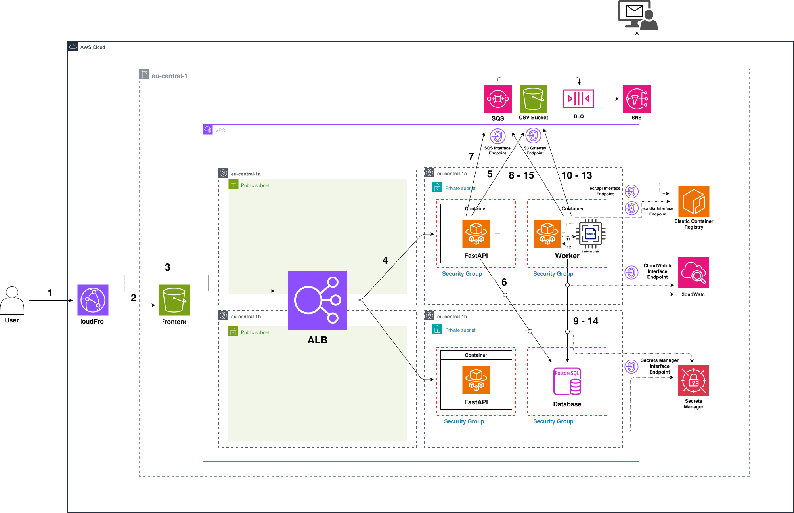
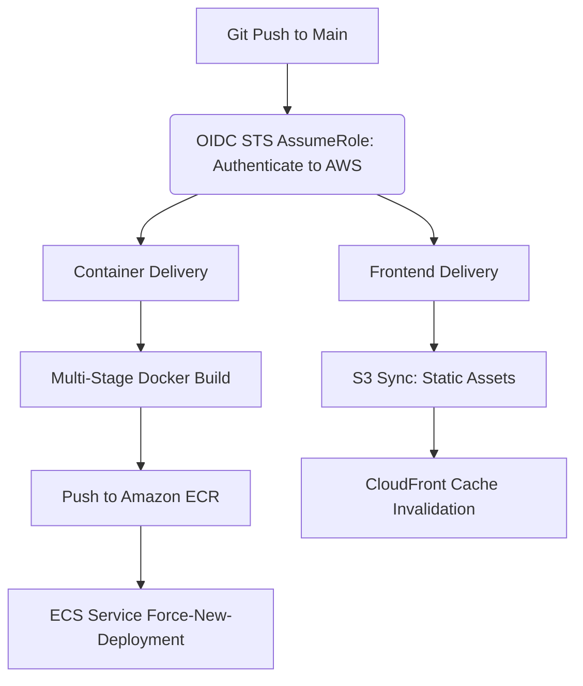

# Terraform-Provisioned Containerized Async CSV Processing Platform

A containerized data processing platform fully provisioned via Terraform on AWS, deploying ECS Fargate and PostgreSQL (RDS) within private subnets, and leveraging SQS & S3 via VPC Endpoints to execute background CSV parsing jobs asynchronously without blocking web requests.

## System Architecture & Execution Lifecycle



### 1. End-to-End Request & Data Flow (1–15)

1. **Static Asset Ingress:** The user initiates an HTTPS request to the CloudFront CDN distribution to access the frontend web interface.
2. **Origin Access Control (OAC):** CloudFront authorizes and fetches static frontend assets (`index.html`, `app.js`) directly from the private Frontend S3 Bucket using AWS SigV4 via OAC.
3. **API Path-Based Routing:** The client-side application sends API requests (e.g., `/upload`, `/jobs/{job_id}`) to the CloudFront domain. CloudFront performs edge TLS termination and routes HTTP requests directly to the Public Application Load Balancer (ALB) origin.
4. **Target Group Ingress:** The ALB distributes incoming HTTP traffic across FastAPI container tasks running on ECS Fargate within isolated private subnets.
5. **Raw File Ingestion:** FastAPI streams the uploaded raw CSV payload directly to the Data S3 Bucket via the private S3 Gateway Endpoint without routing traffic through the public internet.
6. **Job State Initialization:** FastAPI creates a new execution record in PostgreSQL (RDS) with an initial status of `PENDING` over internal VPC routing and immediately returns the generated `job_id` to the client.
7. **Event Publication:** FastAPI generates a job descriptor containing the S3 object key and metadata, publishing the message to the SQS Queue via the SQS Interface Endpoint (AWS PrivateLink).
8. **Message Ingestion (Long-Polling):** The Worker ECS Fargate Task pulls pending job messages from the SQS queue using long-polling over the SQS Interface Endpoint. (The worker continuously polls the SQS queue and processes messages as they arrive. By acting as a buffer, SQS decouples FastAPI from the background worker, enabling reliable asynchronous processing).
9. **State Transition (Processing):** Upon receiving the message, the Worker updates the job status to `PROCESSING` in PostgreSQL (RDS) via internal private subnet routing. 
10. **Raw Payload Retrieval:** The Worker fetches the raw CSV file from the Data S3 Bucket via the S3 Gateway Endpoint into local memory.
11. **Business Logic Delegation:** The Worker forwards the raw CSV stream to its internal business logic layer to execute line-by-line parsing and validation rules.
12. **Validation Output & Summary Generation:** The business logic validates each record, isolates invalid lines with descriptive error reasons, and generates an execution summary alongside the invalid rows dataset.
13. **Error Report Persistence:** The Worker uploads the invalid rows report back to the Data S3 Bucket under the dedicated `results/` prefix via the S3 Gateway Endpoint, ensuring object isolation.
14. **Job Completion & Reference Persistence:** The Worker writes execution summary metrics and the `invalid_rows_s3_key` reference into PostgreSQL (RDS), marking the status as `COMPLETED`. (When the frontend periodically polls `/jobs/{job_id}`, FastAPI reads this reference, generates a secure S3 Presigned URL, and returns the execution summary to the client).
15. **Message Acknowledgment:** The Worker permanently deletes the successfully processed message from the SQS queue via the SQS Interface Endpoint.

> **Note on Asynchronous Fault Tolerance (DLQ & SNS):**  
> Dead-Letter Queue routing is decoupled from the happy-path execution flow. If an unhandled application error occurs or a malformed payload fails processing beyond the configured `maxReceiveCount`, SQS automatically isolates the message in the Dead-Letter Queue (DLQ), triggering an Amazon SNS notification for operational alerting and inspection.

---

### 2. Task Bootstrap & Infrastructure Dependencies

Container tasks operate entirely within isolated private subnets with no internet egress. Initialization and runtime dependencies rely on AWS PrivateLink and Gateway Endpoints:

* **Container Provisioning (ECR Endpoints):** During task startup, the ECS Fargate agent authenticates and pulls container images via `ecr.api` and `ecr.dkr` Interface Endpoints. Container image layers stored under the hood in Amazon S3 are fetched via the S3 Gateway Endpoint.
* **Dynamic Secret Injection (Secrets Manager):** Sensitive database credentials (`username`, `password`, `host`, `port`, `dbname`) are mapped directly within the ECS Task Definition using Secrets Manager JSON key references (`${secret_arn}:key::`). The ECS Task Execution Role resolves and injects these values directly as environment variables at task initialization without requiring custom SDK logic inside the application codebase.
* **Static Configuration Mapping:** Non-sensitive operational parameters (`S3_BUCKET_NAME`, `SQS_QUEUE_URL`) are injected statically as environment variables via Terraform task definitions and accessed via standard environment lookups across Python execution routines.
* **Telemetry & Observability:** stdout and stderr execution logs are captured by the `awslogs` driver and streamed directly to CloudWatch Logs via the CloudWatch Interface Endpoint.

---

### 3. Fault Tolerance & Reliability Model

* **Workload Decoupling & Backpressure Protection:** The ingestion tier (FastAPI) and the processing engine (Worker) are fully decoupled by Amazon SQS. Traffic spikes on file uploads are buffered in the queue, safeguarding compute and database tiers against resource exhaustion.
* **Visibility Timeout & Crash Recovery:** SQS visibility timeouts ensure that in-flight messages remain hidden from concurrent worker threads during execution. If a worker instance fails or crashes prematurely, the message automatically re-appears in the queue for redelivery.
* **Poison Message Containment (DLQ & SNS):** Unprocessable or corrupted CSV payloads that exceed the configured `maxReceiveCount` threshold are automatically diverted to the Dead-Letter Queue (DLQ). This preserves pipeline throughput and prevents execution stalls, while triggering an immediate Amazon SNS alert for operational inspection.

---

### 4. CI/CD & Automated Deployment Pipeline

The delivery pipeline implements automated continuous integration and continuous deployment via GitHub Actions, designed around least-privilege security principles:



**Short-Lived Keyless Authentication (OIDC):** The workflow utilizes OpenID Connect (OIDC) to assume an IAM Role via AWS Security Token Service (STS). Static, long-lived AWS Access Keys are completely eliminated from GitHub repository secrets.
* **Scoped Trust Policy:** The IAM trust relationship strictly validates the identity token issuer (`token.actions.githubusercontent.com`) and restricts access exclusively to this repository subject (`repo:org/repo:*`), mitigating unauthorized lateral movement.
* **Unified Pipeline Execution (`deploy.yml`):**
  * **Frontend Ingress Deployment:** Synchronizes web interface assets to the private Frontend S3 Bucket and triggers a CloudFront cache invalidation (`/*`) to ensure instant global asset updates.
  * **Container Image Delivery:** Builds and tags production Docker images for both `FastAPI` and `Worker` services, pushes them to their respective Amazon ECR repositories, and triggers rolling updates via `aws ecs update-service --force-new-deployment`.
  
  > **Note about separating workflows**
  > I could have separated the frontend and backend GitHub Actions workflows, but decided against it for the scope of this project. However, for more comprehensive enterprise projects where frontend and backend are continuously updated, decoupling these workflows would be the more reasonable approach.

---

### 5. Infrastructure as Code (IaC) & Security Strategy

* **Declarative Infrastructure via Terraform:** All network boundaries (VPC, Subnets, Route Tables), compute configurations (ECS Cluster, Task Definitions, Services), security policies (IAM Roles, Policies), and data stores (S3, RDS PostgreSQL, SQS) are provisioned declaratively via Terraform.
* **Least-Privilege Attack Surface Management:** Infrastructure provisioning is maintained through local, authenticated Terraform workflows rather than delegating broad administrative permissions to external CI/CD runners. The GitHub Actions IAM role is strictly scoped to container image delivery and ECS deployment triggers, significantly reducing the external attack surface.
* **Zero-Trust Network Topology:** No NAT Gateway is provisioned, avoiding unnecessary baseline cloud costs while enforcing strict network isolation. All inter-service communications for private compute workloads are routed through dedicated AWS VPC Endpoints (PrivateLink & Gateway Endpoints).

### 6. Repository Structure & Modular Hierarchy

The codebase is organized as a decoupled monorepo, strictly separating Infrastructure as Code, decoupled containerized application runtimes, local cloud emulation harnesses, and automated testing suites:

```text
.
├── .github/
│   └── workflows/
│       └── deploy.yml              # Keyless OIDC CI/CD deployment pipeline for AWS ECS, S3 & CDN
├── app/
│   ├── core/                       # Shared internal domain logic & database connectivity
│   │   ├── database.py             # Database engine setup & connection pooling
│   │   ├── exceptions.py           # Custom platform exception declarations
│   │   └── models.py               # Pydantic domain schemas & API data transfer objects (DTOs)
│   ├── fastapi/                    # Ingress API service runtime
│   │   ├── Dockerfile              # Multi-stage container build definition for FastAPI
│   │   └── main.py                 # API endpoints for file uploads, job status polling & presigned URLs
│   └── worker/                     # Asynchronous background processing worker runtime
│       ├── Dockerfile              # Container build definition for the queue worker
│       ├── employee_processor.py   # Business logic: CSV parsing, schema validation & error isolation
│       └── worker.py               # SQS consumer loop & job execution lifecycle manager (State transitions)
├── assets/
│   └── architecture-diagram.svg    # System architecture diagram & network boundary assets
├── frontend/                       # Static web interface hosted on private S3 & CloudFront CDN
│   ├── app.js                      # Client logic for file streaming & periodic job polling
│   ├── index.html                  # Single-page interface markup
│   └── styles.css                  # UI styling definitions
├── terraform/                      # Declarative Infrastructure as Code (IaC) layer
│   ├── cdn.tf                      # CloudFront CDN distribution & Origin Access Control (OAC) policies
│   ├── compute.tf                  # ECS Cluster, Task Definitions, Fargate Services & GitHub OIDC IAM
│   ├── db.tf                       # RDS PostgreSQL instance, parameter groups & subnet groups
│   ├── main.tf                     # Provider declarations, AWS region definition, S3 Data Bucket & SQS creation
│   ├── networking.tf               # VPC, Public/Private Subnets, Route Tables & VPC Endpoints
│   ├── outputs.tf                  # Exported resource IDs (CloudFront Distribution ID, GitHub Actions Role ARN, etc.)
│   └── variables.tf                # Input variable declarations 
├── tests/                          # Validation & load testing suites
│   ├── generate_stress_csv.py      # High-throughput mock CSV generator script (10k+ records)
│   └── invalid_employees.csv       # A CSV file containing invalid rows to test the business logic.
├── .dockerignore                   # Build-context optimization rules excluding non-runtime assets
├── .gitignore                      # Git exclusion rules for secrets, TF state & virtual environments
├── requirements-dev.txt            # Local testing, linting, and development dependencies
└── requirements.txt                # Production container runtime dependencies
```

### 7. Local Cloud Emulation & Engineering Methodology

During the initial engineering and verification lifecycle, the decoupled architecture was validated locally prior to production cloud provisioning:

* **Local Cloud Emulation (LocalStack):** S3 bucket operations and SQS asynchronous message polling routines were decoupled from live AWS infrastructure during the prototyping phase using LocalStack. This mitigated unnecessary cloud billing and enabled rapid offline iteration.
* **Service Contract Validation:** The integration contracts between the FastAPI ingestion endpoints, the SQS message schema, and the background Worker state machine were asserted against local mock endpoints (`AWS_ENDPOINT_URL`-> `http://localstack:4566`) before committing infrastructure definitions to Terraform.
* **Production-Only Repository Artifacts:** To maintain a clean and production-grade codebase, local orchestration scripts and ephemeral test mocks were excluded from the deployment artifacts. The platform strictly targets fully managed, declarative AWS infrastructure provisioned via Terraform.


### 8. Production Deployment Guide

Follow this operational guide to provision the complete AWS infrastructure via Terraform and establish automated continuous deployment using GitHub Actions.

#### Prerequisites & Tooling
* **AWS CLI (v2+)** configured with administrative IAM credentials (`aws configure`).
* **Terraform CLI (v1.5+)** installed locally.
* **Git** and an active GitHub repository.

---

#### Step 1: AWS SSO Authentication
Authenticate your local terminal session using AWS IAM Identity Center (SSO) to obtain short-lived credentials without exposing long-lived access keys:

```bash
# Initiate browser-based SSO login
aws sso login --profile default

# Verify authenticated identity and temporary session
aws sts get-caller-identity
```

#### Step 2: Infrastructure Provisioning (Terraform)

1. **Navigate to the Terraform Root:**
   cd terraform
2. **Initialize Provider Plugins:**
   terraform init
3. **Configure Terraform Variables (terraform.tfvars):**
   project_name  = "your-project-name"
   region        = "your-region"
   db_username   = "your-db-user"
   alert_email   = "your-email@example.com"
   github_repo   = "your-username/your-repo-name"
4. **Review Execution Plan & Apply:**
   terraform plan
   terraform apply 
5. **Capture Output Values:**
   terraform output

#### Step 3: Automated Database Initialization (Lifespan Hook)

The PostgreSQL database schema is automatically managed by the application lifecycle:

    During task bootstrap on ECS Fargate, FastAPI's @asynccontextmanager lifespan handler triggers init_db().

    It executes CREATE TABLE IF NOT EXISTS jobs (...) and required schema alters over the internal RDS connection prior to accepting ingress HTTP traffic.

    No manual SQL provisioning or bastion host access is required.

#### Step 4: CI/CD Pipeline & OIDC Setup (GitHub Actions)

Map the captured Terraform outputs into your GitHub repository settings under Settings > Secrets and variables > Actions:

| Variable / Secret Key | Source / Terraform Output | Description |
| :--- | :--- | :--- |
| `AWS_ROLE_ARN` | `github_actions_role_arn` | IAM Role ARN assumed by GitHub via OIDC STS |

| Variable Name | Source / Terraform Output Mapping | Description |
| :--- | :--- | :--- |
| `PROJECT_NAME` | `project_name` variable (e.g., `async-job-processing`) | Base naming prefix for ECR and ECS resources |
| `FRONTEND_BUCKET_NAME` | `frontend_bucket_name` | Private S3 bucket hosting static web assets |
| `CLOUDFRONT_DISTRIBUTION_ID` | `cloudfront_distribution_id` | CloudFront Distribution ID for edge cache invalidations |

#### Step 5: Initial Pipeline Execution

Commit and push your changes to the main branch to trigger the end-to-end continuous deployment workflow:

git add .
git commit -m "feat: trigger initial production deployment"
git push origin main

Pipeline Execution Lifecycle:

    1- OIDC Authentication: GitHub Actions assumes the scoped IAM role via AWS STS without long-lived access keys.

    2- Container Build & Registry Ingestion: Builds FastAPI and Worker container images, tagging them with the commit SHA and latest, then pushes them to Amazon ECR.

    3- ECS Rolling Deployment: Executes aws ecs update-service --force-new-deployment to trigger zero-downtime task replacements on ECS Fargate.

    4- Static Delivery & CDN Invalidation: Synchronizes ./frontend static assets to the private S3 bucket with --delete and triggers a CloudFront edge cache invalidation (/*).

#### Step 6: Verification & Production Access

Once the deployment workflow completes successfully, retrieve the live application URL from Terraform:

terraform output cloudfront_domain_name

Open the returned CloudFront domain name in your browser to access the live, edge-accelerated web interface.